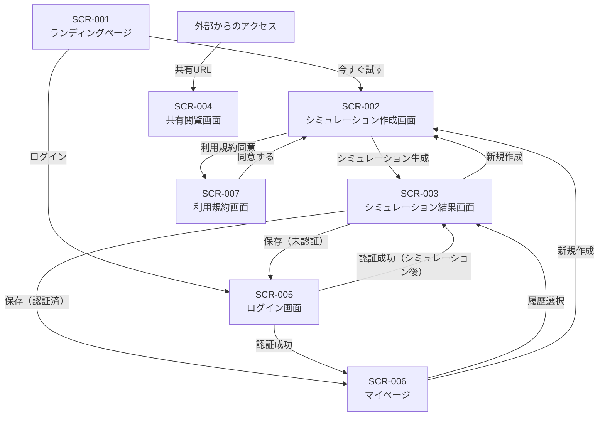

# Cao - 業務仕様書

## 1. 概要

### 1.1 プロダクト名
**Cao**（カオ）

### 1.2 目的
美容医療やエステにおいて、顧客が「理想の自分」を施術者に視覚的に伝えられるようにするAI顔シミュレーションサービス。

ユーザーの現在の顔写真と理想の顔を入力し、段階的なモーフィングシミュレーションを生成することで、「私は50%くらいまで近づきたい」といった希望を具体的に確認・共有できる。

### 1.3 ターゲットユーザー

| ユーザー種別 | 説明 |
|-------------|------|
| **Primary** | 美容医療検討者（25-45歳女性、ヒアルロン酸・ボトックス・糸リフト等を検討中） |
| **Secondary** | 美容施術者（クリニック医師、エステティシャン）※Phase 2以降 |

### 1.4 解決する課題

| 課題 | 解決方法 |
|------|----------|
| 言語化できない | ビジュアルシミュレーションで「この画像の状態にしたい」と伝えられる |
| イメージが湧かない | 自分の顔でシミュレーションを確認できる |
| 比較できない | 段階的モーフィングで現在→理想を比較できる |
| 共有できない | URL共有機能で施術者と認識を合わせられる |
| 決断できない | パーツ別・段階別調整で小さく始める判断ができる |

---

## 2. ユースケース一覧

### UC-001: 利用規約への同意

| 項目 | 内容 |
|------|------|
| **アクター** | 未認証ユーザー / 認証済みユーザー |
| **事前条件** | サービスにアクセスしている |
| **事後条件** | 利用規約に同意済みの状態になる |

**基本フロー**:
1. ユーザーが画像アップロード画面にアクセスする
2. システムが利用規約同意ダイアログを表示する
3. ユーザーが利用規約を確認する
4. ユーザーが「同意する」ボタンをクリックする
5. システムが同意状態をローカルストレージに保存する
6. 画像アップロードが可能になる

**代替フロー**:
- 3a. ユーザーが同意しない場合
  - 画像アップロード機能は利用不可のまま

---

### UC-002: 現在の顔画像をアップロード

| 項目 | 内容 |
|------|------|
| **アクター** | 未認証ユーザー / 認証済みユーザー |
| **事前条件** | 利用規約に同意済み |
| **事後条件** | 現在の顔画像がシステムにアップロードされる |

**基本フロー**:
1. ユーザーがアップロードエリアをクリックまたはドラッグ&ドロップ
2. システムがファイル選択ダイアログを表示
3. ユーザーが画像ファイルを選択
4. システムが画像形式・サイズを検証
5. システムが顔検出処理を実行
6. システムが顔検出成功を確認し、プレビューを表示
7. 画像がアップロード完了状態になる

**代替フロー**:
- 4a. 画像形式が不正な場合
  - エラーメッセージ「JPEG、PNG形式の画像をアップロードしてください」を表示
- 4b. 画像サイズが上限を超える場合
  - エラーメッセージ「画像サイズは10MB以下にしてください」を表示
- 5a. 顔が検出されない場合
  - エラーメッセージ「顔を検出できませんでした」を表示
  - ガイダンス「正面を向いた明るい写真をお使いください」を表示
- 5b. 複数の顔が検出された場合
  - エラーメッセージ「複数の顔が検出されました。1人のみ写った写真をお使いください」を表示

---

### UC-003: 理想の顔画像をアップロード

| 項目 | 内容 |
|------|------|
| **アクター** | 未認証ユーザー / 認証済みユーザー |
| **事前条件** | 利用規約に同意済み、現在の顔画像アップロード済み |
| **事後条件** | 理想の顔画像がシステムにアップロードされる |

**基本フロー**:
UC-002と同様

**代替フロー**:
UC-002と同様

---

### UC-004: モーフィングシミュレーションを生成

| 項目 | 内容 |
|------|------|
| **アクター** | 未認証ユーザー / 認証済みユーザー |
| **事前条件** | 現在の顔画像と理想の顔画像がアップロード済み |
| **事後条件** | 段階的モーフィング画像が生成される |

**基本フロー**:
1. ユーザーが「シミュレーション生成」ボタンをクリック
2. システムがローディング表示を開始
3. システムがバックエンドAPIにモーフィングリクエストを送信
4. バックエンドが段階的モーフィング画像（0%, 25%, 50%, 75%, 100%）を生成
5. システムが生成結果を受信し表示
6. ユーザーがスライダーで各段階を確認できる

**代替フロー**:
- 3a. API通信エラーの場合
  - エラーメッセージ「通信エラーが発生しました。再度お試しください」を表示
- 4a. 処理タイムアウトの場合
  - エラーメッセージ「処理がタイムアウトしました。画像を変更してお試しください」を表示

---

### UC-005: シミュレーション結果をスライダーで確認

| 項目 | 内容 |
|------|------|
| **アクター** | 未認証ユーザー / 認証済みユーザー |
| **事前条件** | モーフィングシミュレーション生成済み |
| **事後条件** | ユーザーが希望の変化度合いを確認できる |

**基本フロー**:
1. システムが段階的モーフィング結果を表示
2. ユーザーがスライダーを操作
3. スライダー位置に応じた変化度合いの画像が表示される
4. ユーザーが「この段階がいい」と判断できる

---

### UC-006: シミュレーション結果を保存（認証済みユーザーのみ）

| 項目 | 内容 |
|------|------|
| **アクター** | 認証済みユーザー |
| **事前条件** | モーフィングシミュレーション生成済み、ログイン済み |
| **事後条件** | シミュレーション結果がユーザーアカウントに紐づけて保存される |

**基本フロー**:
1. ユーザーが「保存」ボタンをクリック
2. システムがシミュレーション結果をSupabase Storageに保存
3. システムがシミュレーションメタデータをDBに保存
4. 保存完了メッセージを表示

**代替フロー**:
- 1a. 未認証ユーザーの場合
  - ログイン誘導メッセージ「保存するにはログインが必要です」を表示
  - ログイン画面へのリンクを表示

---

### UC-007: 共有URLを生成（認証済みユーザーのみ）

| 項目 | 内容 |
|------|------|
| **アクター** | 認証済みユーザー |
| **事前条件** | シミュレーション結果が保存済み |
| **事後条件** | 共有可能なURLが生成される |

**基本フロー**:
1. ユーザーが「共有URLを作成」ボタンをクリック
2. システムがユニークな共有トークンを生成
3. システムがシミュレーションを共有可能状態に更新
4. 共有URL（例: `cao.app/s/{share_token}`）を表示
5. ユーザーがURLをコピー

---

### UC-008: 共有URLからシミュレーション結果を閲覧

| 項目 | 内容 |
|------|------|
| **アクター** | 任意のユーザー（施術者を想定） |
| **事前条件** | 有効な共有URLを持っている |
| **事後条件** | シミュレーション結果を閲覧できる |

**基本フロー**:
1. ユーザーが共有URLにアクセス
2. システムが共有トークンを検証
3. システムがシミュレーション結果を取得
4. 閲覧専用モードでシミュレーション結果を表示
5. スライダーで各段階を確認可能

**代替フロー**:
- 2a. 無効な共有トークンの場合
  - エラーページ「このURLは無効です」を表示

---

### UC-009: ユーザー登録・ログイン

| 項目 | 内容 |
|------|------|
| **アクター** | 未認証ユーザー |
| **事前条件** | サービスにアクセスしている |
| **事後条件** | ユーザーアカウントが作成され、ログイン状態になる |

**基本フロー**:
1. ユーザーが「ログイン/登録」ボタンをクリック
2. システムがログイン画面を表示
3. ユーザーがメールアドレスを入力
4. システムがマジックリンクをメール送信
5. ユーザーがメールのリンクをクリック
6. システムがユーザーを認証し、ダッシュボードにリダイレクト

**代替フロー**:
- 3a. Googleログインを選択した場合
  - GoogleのOAuth認証フローを実行
- 3b. LINEログインを選択した場合
  - LINEのOAuth認証フローを実行

---

### UC-010: 保存済みシミュレーションの履歴確認

| 項目 | 内容 |
|------|------|
| **アクター** | 認証済みユーザー |
| **事前条件** | ログイン済み、過去にシミュレーションを保存済み |
| **事後条件** | 過去のシミュレーション一覧を確認できる |

**基本フロー**:
1. ユーザーがマイページにアクセス
2. システムがユーザーの保存済みシミュレーション一覧を取得
3. サムネイル付きリストで表示
4. ユーザーが任意のシミュレーションを選択
5. 詳細画面でシミュレーション結果を確認

---

### UC-011: パーツ別ブレンドシミュレーションを生成

| 項目 | 内容 |
|------|------|
| **アクター** | 未認証ユーザー / 認証済みユーザー |
| **事前条件** | 現在の顔画像と理想の顔画像がアップロード済み |
| **事後条件** | 選択したパーツが合成された画像が生成される |

**基本フロー**:
1. ユーザーがパーツ別ブレンドモードを選択
2. システムが適用可能なパーツ（目、眉、鼻、口）を表示
3. ユーザーが適用するパーツを選択（ON/OFF）
4. ユーザーが「ブレンド生成」ボタンをクリック
5. システムがローディング表示を開始
6. システムがバックエンドAPIにブレンドリクエストを送信
7. バックエンドが以下の処理を実行:
   - 両画像から顔のランドマークを検出
   - 理想の顔から指定パーツを切り出し
   - パーツの位置・角度・サイズを現在の顔に合わせて変換
   - 色調を補正し、シームレスに合成
8. システムが生成結果を受信
9. **認証状態による表示分岐**:
   - 認証済み: 結果画像をそのまま表示
   - 未認証: 結果画像にブラー（ぼかし）を適用して表示
10. ユーザーがパーツのON/OFFを変更して再生成可能

**代替フロー**:
- 3a. パーツを1つも選択しない場合
  - エラーメッセージ「適用するパーツを1つ以上選択してください」を表示
- 6a. API通信エラーの場合
  - エラーメッセージ「通信エラーが発生しました。再度お試しください」を表示
- 7a. 顔の向きが正面でない場合
  - エラーメッセージ「正面を向いた写真をお使いください」を表示
- 9a. 未認証ユーザーがブラー画像をタップした場合
  - ログイン誘導モーダルを表示（UC-012へ）

---

### UC-012: ブラー画像からログインして結果を閲覧

| 項目 | 内容 |
|------|------|
| **アクター** | 未認証ユーザー |
| **事前条件** | パーツ別シミュレーションが生成済み、結果がブラー表示されている |
| **事後条件** | ログイン完了後、ブラーなしで結果画像が閲覧できる。シミュレーション結果は保持される |

**基本フロー**:
1. 未認証ユーザーがブラーされた結果画像をタップ
2. システムがログイン誘導モーダルを表示
   - メッセージ「パーツ別シミュレーションの結果を見るにはログインが必要です」
   - 「ログインする」ボタン
   - 「今はログインしない」リンク
3. ユーザーが「ログインする」をクリック
4. **システムが現在のシミュレーション状態（画像データ、パーツ選択状態）をsessionStorageに保持**
5. Clerkのモーダル内でログイン処理を実行（ページ遷移なし）
6. ログイン完了後、**同一ページ上で認証状態が更新される**
7. パーツ別シミュレーション結果がブラーなしで表示される

**代替フロー**:
- 3a. 「今はログインしない」を選択した場合
  - モーダルを閉じる
  - ブラー表示を維持

**技術要件**:
- シミュレーション画像データはsessionStorageに保存済み（UC-004で保存）
- ログイン処理はClerkのモーダルモードを使用し、ページ遷移を発生させない
- ログイン完了後はClerkの認証状態変更を検知し、UIを自動更新する

---

## 3. 画面一覧

### 3.1 画面定義

| 画面ID | 画面名 | 目的 | 主要要素 |
|--------|--------|------|----------|
| SCR-001 | ランディングページ | サービス紹介、利用開始 | サービス説明、CTA「今すぐ試す」 |
| SCR-002 | シミュレーション作成画面 | 画像アップロード、シミュレーション生成 | アップロードエリア×2、生成ボタン |
| SCR-003 | シミュレーション結果画面 | 生成結果の確認、保存、共有 | 結果画像、スライダー、保存/共有ボタン |
| SCR-004 | 共有閲覧画面 | 共有されたシミュレーションの閲覧 | 結果画像、スライダー（閲覧専用） |
| SCR-005 | ログイン画面 | ユーザー認証 | メール入力、ソーシャルログインボタン |
| SCR-006 | マイページ | 保存済みシミュレーション管理 | シミュレーション一覧、アカウント設定 |
| SCR-007 | 利用規約画面 | 利用規約の確認 | 規約本文、同意ボタン |
| SCR-008 | プライバシーポリシー画面 | プライバシーポリシーの確認 | ポリシー本文 |

### 3.2 画面遷移図



---

## 4. 業務ルール

### 4.1 画像に関する制約

| ルールID | ルール名 | 内容 |
|----------|----------|------|
| BR-IMG-001 | 対応形式 | JPEG、PNG形式のみ受け付ける |
| BR-IMG-002 | ファイルサイズ上限 | 10MB以下 |
| BR-IMG-003 | 画像解像度上限 | 処理前に最大2048pxにリサイズ |
| BR-IMG-004 | 顔検出必須 | アップロード画像から顔が検出できること |
| BR-IMG-005 | 単一顔のみ | 複数の顔が検出された場合はエラーとして拒否 |

### 4.2 顔検出に関するルール

| ルールID | ルール名 | 内容 |
|----------|----------|------|
| BR-FACE-001 | 顔検出失敗時 | エラーメッセージとガイダンスを表示して再アップロードを促す |
| BR-FACE-002 | 複数顔検出時 | 「複数の顔が検出されました」エラーを表示、選択機能は提供しない |
| BR-FACE-003 | ガイダンス内容 | 「正面を向いた明るい写真をお使いください」等のヒントを表示 |

### 4.3 ユーザー利用制限

| ルールID | ルール名 | 未認証ユーザー | 認証済みユーザー |
|----------|----------|----------------|------------------|
| BR-USER-001 | 全体シミュレーション生成 | 可能 | 可能 |
| BR-USER-002 | 全体シミュレーション結果閲覧 | 可能（ブラーなし） | 可能（ブラーなし） |
| BR-USER-003 | パーツ別シミュレーション生成 | 可能 | 可能 |
| BR-USER-004 | パーツ別シミュレーション結果閲覧 | ブラー表示（タップでログイン誘導） | 可能（ブラーなし） |
| BR-USER-005 | シミュレーション保存 | 不可 | 可能 |
| BR-USER-006 | 共有URL生成 | 不可 | 可能 |
| BR-USER-007 | 履歴閲覧 | 不可 | 可能 |
| BR-USER-008 | APIレート制限 | 10 requests/min | 30 requests/min |

### 4.4 データ保持ポリシー

| ルールID | ルール名 | 内容 |
|----------|----------|------|
| BR-DATA-001 | 未認証ユーザーの画像 | セッション終了後、サーバーに保持しない |
| BR-DATA-002 | 認証済みユーザーの画像 | ユーザーアカウントに紐づけて保存 |
| BR-DATA-003 | 共有シミュレーション | 共有URLが有効な間は削除しない |
| BR-DATA-004 | 共有URL有効期限 | 無期限（ユーザーが明示的に削除するまで有効） |

### 4.5 利用規約・プライバシー

| ルールID | ルール名 | 内容 |
|----------|----------|------|
| BR-TERMS-001 | 同意タイミング | 画像アップロード前に利用規約同意必須 |
| BR-TERMS-002 | 同意の記録 | ローカルストレージに同意状態を保存 |
| BR-TERMS-003 | 再同意 | ブラウザデータクリア後は再度同意が必要 |

---

## 5. MVP機能スコープ

### 5.1 Phase 1（MVP）- 実装対象

| カテゴリ | 機能 | 優先度 |
|----------|------|--------|
| **画像アップロード** | 現在の顔画像アップロード | 必須 |
| **画像アップロード** | 理想の顔画像アップロード | 必須 |
| **顔検出** | 顔検出（単一顔のみ） | 必須 |
| **顔検出** | 顔検出失敗時のエラー＋ガイダンス | 必須 |
| **顔検出** | 複数顔検出時のエラー | 必須 |
| **シミュレーション** | 段階的モーフィング生成（0%, 25%, 50%, 75%, 100%） | 必須 |
| **シミュレーション** | スライダーによる変化度合い確認 | 必須 |
| **シミュレーション** | パーツ別ブレンド（目、眉、鼻、口のON/OFF選択） | 必須 |
| **認証** | メールマジックリンク認証 | 必須 |
| **認証** | Googleログイン | 必須 |
| **保存・共有** | シミュレーション結果保存（認証済みのみ） | 必須 |
| **保存・共有** | 共有URL生成（認証済みのみ） | 必須 |
| **保存・共有** | 共有URLからの閲覧 | 必須 |
| **規約** | 利用規約同意フロー | 必須 |
| **履歴** | 保存済みシミュレーション一覧 | 必須 |

### 5.2 Phase 2以降（MVP対象外）

| カテゴリ | 機能 | 備考 |
|----------|------|------|
| **画像入力** | 理想の顔プリセット | 後日指示 |
| **シミュレーション** | パーツ別ブレンド率調整 | 後日指示（MVP: ON/OFFのみ） |
| **シミュレーション** | GIFアニメーション生成 | 後日指示 |
| **認証** | LINEログイン | 後日指示 |
| **施術者向け** | 施術者専用ブラウザ閲覧機能 | 後日指示 |
| **課金** | Proプラン | 現時点では考慮不要 |

### 5.3 MVP機能境界の明確化

```
┌─────────────────────────────────────────────────────────────┐
│                     MVP (Phase 1)                          │
│                                                             │
│  ┌─────────────┐  ┌─────────────┐  ┌─────────────────────┐ │
│  │ 画像アップ   │  │ 顔検出      │  │ モーフィング生成   │ │
│  │ ロード      │  │ （単一顔）   │  │ （5段階）          │ │
│  └─────────────┘  └─────────────┘  └─────────────────────┘ │
│                                                             │
│  ┌─────────────┐  ┌─────────────┐  ┌─────────────────────┐ │
│  │ ユーザー     │  │ 結果保存    │  │ 共有URL生成・      │ │
│  │ 認証        │  │ （認証済）   │  │ 閲覧              │ │
│  └─────────────┘  └─────────────┘  └─────────────────────┘ │
│                                                             │
│  ┌─────────────┐  ┌─────────────┐                          │
│  │ 利用規約    │  │ 履歴閲覧    │                          │
│  │ 同意       │  │             │                          │
│  └─────────────┘  └─────────────┘                          │
└─────────────────────────────────────────────────────────────┘

┌─────────────────────────────────────────────────────────────┐
│                   Phase 2以降（対象外）                     │
│                                                             │
│  - プリセット理想顔                                         │
│  - パーツ別調整                                             │
│  - GIFアニメーション                                        │
│  - LINEログイン                                             │
│  - 施術者向け機能                                           │
│  - Proプラン                                                │
└─────────────────────────────────────────────────────────────┘
```

---

## 6. 用語定義

| 用語 | 定義 |
|------|------|
| 現在の顔画像 | ユーザーがアップロードする、現時点の自分の顔写真 |
| 理想の顔画像 | ユーザーがなりたい顔として設定する参考画像 |
| モーフィング | 現在の顔から理想の顔への段階的な変形処理 |
| パーツ別ブレンド | 理想の顔の特定パーツ（目、眉、鼻、口）を現在の顔に合成する処理 |
| 変化度合い | 0%（現在の顔そのまま）〜100%（理想の顔そのまま）の間の変化の程度 |
| 共有URL | シミュレーション結果を第三者（施術者等）と共有するためのユニークなURL |
| 共有トークン | 共有URLに含まれる一意識別子 |

---

## 変更履歴

| バージョン | 日付 | 変更内容 | 担当 |
|------------|------|----------|------|
| 1.0.0 | 2025-01-23 | 初版作成 | Spec Agent |
| 1.1.0 | 2025-01-25 | パーツ別ブレンド機能（UC-011）追加 | Spec Agent |
| 1.2.0 | 2025-01-27 | 認証とシミュレーションの関係修正: パーツ別結果のブラー表示（UC-011更新、UC-012追加）、ユーザー利用制限更新 | Spec Agent |
| 1.2.1 | 2025-01-28 | UC-012更新: ログイン処理をモーダル内で完結させ、シミュレーション状態を保持するよう修正 | Spec Agent |
