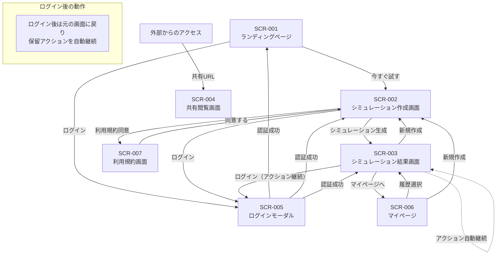

# Cao - 業務仕様書

## 1. 概要

### 1.1 プロダクト名
**Cao**（カオ）

### 1.2 目的
美容医療やエステにおいて、顧客が「理想の自分」を施術者に視覚的に伝えられるようにするAI顔シミュレーションサービス。

ユーザーの現在の顔写真と理想の顔を入力し、段階的なモーフィングシミュレーションを生成することで、「私は50%くらいまで近づきたい」といった希望を具体的に確認・共有できる。

### 1.3 ターゲットユーザー

| ユーザー種別 | 説明 |
|-------------|------|
| **Primary** | 美容医療検討者（25-45歳女性、ヒアルロン酸・ボトックス・糸リフト等を検討中） |
| **Secondary** | 美容施術者（クリニック医師、エステティシャン）※Phase 2以降 |

### 1.4 解決する課題

| 課題 | 解決方法 |
|------|----------|
| 言語化できない | ビジュアルシミュレーションで「この画像の状態にしたい」と伝えられる |
| イメージが湧かない | 自分の顔でシミュレーションを確認できる |
| 比較できない | 段階的モーフィングで現在→理想を比較できる |
| 共有できない | URL共有機能で施術者と認識を合わせられる |
| 決断できない | パーツ別・段階別調整で小さく始める判断ができる |

---

## 2. ユースケース一覧

### UC-001: 利用規約への同意

| 項目 | 内容 |
|------|------|
| **アクター** | 未認証ユーザー / 認証済みユーザー |
| **事前条件** | サービスにアクセスしている |
| **事後条件** | 利用規約に同意済みの状態になる |

**基本フロー**:
1. ユーザーが画像アップロード画面にアクセスする
2. システムが利用規約同意ダイアログを表示する
3. ユーザーが利用規約を確認する
4. ユーザーが「同意する」ボタンをクリックする
5. システムが同意状態をローカルストレージに保存する
6. 画像アップロードが可能になる

**代替フロー**:
- 3a. ユーザーが同意しない場合
  - 画像アップロード機能は利用不可のまま

---

### UC-002: 現在の顔画像をアップロード

| 項目 | 内容 |
|------|------|
| **アクター** | 未認証ユーザー / 認証済みユーザー |
| **事前条件** | 利用規約に同意済み |
| **事後条件** | 現在の顔画像がシステムにアップロードされる |

**基本フロー**:
1. ユーザーがアップロードエリアをクリックまたはドラッグ&ドロップ
2. システムがファイル選択ダイアログを表示
3. ユーザーが画像ファイルを選択
4. システムが画像形式・サイズを検証
5. システムが顔検出処理を実行
6. システムが顔検出成功を確認し、プレビューを表示
7. 画像がアップロード完了状態になる

**代替フロー**:
- 4a. 画像形式が不正な場合
  - エラーメッセージ「JPEG、PNG形式の画像をアップロードしてください」を表示
- 4b. 画像サイズが上限を超える場合
  - エラーメッセージ「画像サイズは10MB以下にしてください」を表示
- 5a. 顔が検出されない場合
  - エラーメッセージ「顔を検出できませんでした」を表示
  - ガイダンス「正面を向いた明るい写真をお使いください」を表示
- 5b. 複数の顔が検出された場合
  - エラーメッセージ「複数の顔が検出されました。1人のみ写った写真をお使いください」を表示

---

### UC-003: 理想の顔画像をアップロード

| 項目 | 内容 |
|------|------|
| **アクター** | 未認証ユーザー / 認証済みユーザー |
| **事前条件** | 利用規約に同意済み、現在の顔画像アップロード済み |
| **事後条件** | 理想の顔画像がシステムにアップロードされる |

**基本フロー**:
UC-002と同様

**代替フロー**:
UC-002と同様

---

### UC-004: モーフィングシミュレーションを生成

| 項目 | 内容 |
|------|------|
| **アクター** | 未認証ユーザー / 認証済みユーザー |
| **事前条件** | 現在の顔画像と理想の顔画像がアップロード済み |
| **事後条件** | 段階的モーフィング画像が生成される |

**基本フロー**:
1. ユーザーが「シミュレーション生成」ボタンをクリック
2. システムがローディング表示を開始
3. システムがバックエンドAPIにモーフィングリクエストを送信
4. バックエンドが段階的モーフィング画像（0%, 25%, 50%, 75%, 100%）を生成
5. システムが生成結果を受信し表示
6. ユーザーがスライダーで各段階を確認できる

**代替フロー**:
- 3a. API通信エラーの場合
  - エラーメッセージ「通信エラーが発生しました。再度お試しください」を表示
- 4a. 処理タイムアウトの場合
  - エラーメッセージ「処理がタイムアウトしました。画像を変更してお試しください」を表示

---

### UC-005: シミュレーション結果をスライダーで確認

| 項目 | 内容 |
|------|------|
| **アクター** | 未認証ユーザー / 認証済みユーザー |
| **事前条件** | モーフィングシミュレーション生成済み |
| **事後条件** | ユーザーが希望の変化度合いを確認できる |

**基本フロー**:
1. システムが段階的モーフィング結果を表示
2. ユーザーがスライダーを操作
3. スライダー位置に応じた変化度合いの画像が表示される
4. ユーザーが「この段階がいい」と判断できる

---

### UC-006: シミュレーション結果を保存（認証済みユーザーのみ）

| 項目 | 内容 |
|------|------|
| **アクター** | 認証済みユーザー |
| **事前条件** | モーフィングシミュレーション生成済み、ログイン済み |
| **事後条件** | シミュレーション結果がユーザーアカウントに紐づけて保存される |

**基本フロー**:
1. ユーザーが「保存」ボタンをクリック
2. システムがシミュレーション結果をSupabase Storageに保存
3. システムがシミュレーションメタデータをDBに保存
4. 保存完了メッセージを表示

**代替フロー**:
- 1a. 未認証ユーザーの場合
  - ログイン誘導メッセージ「保存するにはログインが必要です」を表示
  - ログイン画面へのリンクを表示

---

### UC-007: 共有URLを生成（認証済みユーザーのみ）

| 項目 | 内容 |
|------|------|
| **アクター** | 認証済みユーザー |
| **事前条件** | シミュレーション結果が保存済み |
| **事後条件** | 共有可能なURLが生成される |

**基本フロー**:
1. ユーザーが「共有URLを作成」ボタンをクリック
2. システムがユニークな共有トークンを生成
3. システムがシミュレーションを共有可能状態に更新
4. 共有URL（例: `cao.app/s/{share_token}`）を表示
5. ユーザーがURLをコピー

---

### UC-008: 共有URLからシミュレーション結果を閲覧

| 項目 | 内容 |
|------|------|
| **アクター** | 任意のユーザー（施術者を想定） |
| **事前条件** | 有効な共有URLを持っている |
| **事後条件** | シミュレーション結果を閲覧できる |

**基本フロー**:
1. ユーザーが共有URLにアクセス
2. システムが共有トークンを検証
3. システムがシミュレーション結果を取得
4. 閲覧専用モードでシミュレーション結果を表示
5. スライダーで各段階を確認可能

**代替フロー**:
- 2a. 無効な共有トークンの場合
  - エラーページ「このURLは無効です」を表示

---

### UC-009: ユーザー登録・ログイン

| 項目 | 内容 |
|------|------|
| **アクター** | 未認証ユーザー |
| **事前条件** | サービスにアクセスしている |
| **事後条件** | ユーザーアカウントが作成され、ログイン状態になる |

**基本フロー**:
1. ユーザーが「ログイン」ボタンをクリック（ヘッダー右上に常時表示）
2. システムがログインモーダルを表示
3. ユーザーがメールアドレスを入力
4. システムがマジックリンクをメール送信
5. ユーザーがメールのリンクをクリック
6. システムがユーザーを認証し、**ログイン前の画面に戻る**（ページ遷移なし）
7. 保留中のアクションがある場合は自動的に継続（UC-012参照）

**代替フロー**:
- 3a. Googleログインを選択した場合
  - GoogleのOAuth認証フローを実行
  - 認証完了後、ログイン前の画面に戻る
- 3b. LINEログインを選択した場合
  - LINEのOAuth認証フローを実行
  - 認証完了後、ログイン前の画面に戻る

**ヘッダー表示ルール**:
- 未認証時: 「ログイン」ボタンを表示
- 認証済み時: 「ログイン」ボタンを表示（クリックでマイページへ遷移）

---

### UC-010: 保存済みシミュレーションの履歴確認

| 項目 | 内容 |
|------|------|
| **アクター** | 認証済みユーザー |
| **事前条件** | ログイン済み、過去にシミュレーションを保存済み |
| **事後条件** | 過去のシミュレーション一覧を確認できる |

**基本フロー**:
1. ユーザーがマイページにアクセス
2. システムがユーザーの保存済みシミュレーション一覧を取得
3. サムネイル付きリストで表示
4. ユーザーが任意のシミュレーションを選択
5. 詳細画面でシミュレーション結果を確認

---

### UC-011: パーツ別ブレンドシミュレーションを生成

| 項目 | 内容 |
|------|------|
| **アクター** | 未認証ユーザー / 認証済みユーザー |
| **事前条件** | 現在の顔画像と理想の顔画像がアップロード済み |
| **事後条件** | 選択したパーツが合成された画像が生成される |

**基本フロー**:
1. ユーザーがパーツ別ブレンドモードを選択
2. システムが適用可能なパーツ（目、眉、鼻、口）を表示
3. ユーザーが適用するパーツを選択（ON/OFF）
4. ユーザーが「ブレンド生成」ボタンをクリック
5. システムがローディング表示を開始
6. システムがバックエンドAPIにブレンドリクエストを送信
7. バックエンドが以下の処理を実行:
   - 両画像から顔のランドマークを検出
   - 理想の顔から指定パーツを切り出し
   - パーツの位置・角度・サイズを現在の顔に合わせて変換
   - 色調を補正し、シームレスに合成
8. システムが生成結果を受信
9. **認証状態による表示分岐**:
   - 認証済み: 結果画像をそのまま表示
   - 未認証: 結果画像にブラー（ぼかし）を適用して表示
10. ユーザーがパーツのON/OFFを変更して再生成可能

**代替フロー**:
- 3a. パーツを1つも選択しない場合
  - エラーメッセージ「適用するパーツを1つ以上選択してください」を表示
- 6a. API通信エラーの場合
  - エラーメッセージ「通信エラーが発生しました。再度お試しください」を表示
- 7a. 顔の向きが正面でない場合
  - エラーメッセージ「正面を向いた写真をお使いください」を表示
- 9a. 未認証ユーザーがブラー画像をタップした場合
  - ログイン誘導モーダルを表示（UC-012へ）

---

### UC-012: ログインして直前のアクションを継続

| 項目 | 内容 |
|------|------|
| **アクター** | 未認証ユーザー |
| **事前条件** | シミュレーション結果画面を表示中、ログインが必要なアクションを実行しようとした |
| **事後条件** | ログイン完了後、**同じ画面に留まったまま**直前のアクションが自動的に継続・実行される |

**トリガーとなるアクション**:
- パーツ別シミュレーションのブラー画像をタップ（結果閲覧）
- ダウンロードボタンをクリック（認証が必要な場合）
- 保存ボタンをクリック
- SNS共有ボタンをクリック

**基本フロー**:
1. 未認証ユーザーがログインが必要なアクションを実行
2. システムが以下の状態をsessionStorageに保存:
   - `cao_pending_action`: 実行しようとしたアクション（'parts-blur' | 'download' | 'save' | 'share'）
   - `cao_view_mode`: 現在の表示モード（'morph' | 'parts'）
   - `cao_parts_selection`: パーツ選択状態（JSON）
3. システムがログイン誘導モーダルを表示
   - アクションに応じたメッセージ
   - 「ログインする」ボタン
   - 「今はログインしない」リンク
4. ユーザーが「ログインする」をクリック
5. Clerkのモーダル内でログイン処理を実行（**ページ遷移なし、同じ画面に留まる**）
6. ログイン完了後、ユーザーは**シミュレーション結果画面に留まったまま**
7. システムがsessionStorageから保留中のアクションを取得し、自動実行:
   - **parts-blur**: パーツ別表示モードに切り替え、ブラーを解除して結果を表示
   - **download**: 現在表示中の画像をダウンロード
   - **save**: 保存処理を実行
   - **share**: SNSシェアフローを開始（UC-014へ）
8. 実行完了後、sessionStorageから保留アクション情報を削除

**代替フロー**:
- 4a. 「今はログインしない」を選択した場合
  - モーダルを閉じる
  - sessionStorageから保留アクション情報を削除
  - 元の状態を維持（シミュレーション結果画面に留まる）

**重要な動作原則**:
- **トップページへのリダイレクトは行わない**: ログイン完了後は必ず元の画面に留まる
- **シミュレーション状態は保持**: 生成済みのシミュレーション結果、選択中のスライダー位置、パーツ選択状態は全て維持される
- **アクションの自動継続**: ユーザーが実行しようとしたアクションは、ログイン完了後に自動的に続行される

**技術要件**:
- シミュレーション画像データはsessionStorageに保存済み（UC-004で保存）
- ログイン処理はClerkのモーダルモードを使用し、ページ遷移を発生させない
- ログイン完了後はClerkの認証状態変更を検知（ポーリング1秒間隔）
- 認証状態変更検知時に保留アクションをチェックし自動実行
- 保留アクション実行後は必ずsessionStorageをクリーンアップ

---

### UC-013: シェアボタンの表示

| 項目 | 内容 |
|------|------|
| **アクター** | 認証済みユーザー / 未認証ユーザー |
| **事前条件** | シミュレーション結果が生成済み |
| **事後条件** | シェアボタンが表示される |

**基本フロー**:
1. ユーザーがシミュレーション結果画面を表示
2. システムがシェアボタンを表示
3. ユーザーが「シェア」ボタンをタップ
4. UC-014（シェア画像タイプの選択）へ進む

**代替フロー**:
- 3a. 未認証ユーザーの場合
  - ログイン誘導モーダルを表示（UC-012へ）
  - ログイン成功後、UC-014へ進む

---

### UC-014: シェア画像タイプの選択（認証必須）

| 項目 | 内容 |
|------|------|
| **アクター** | 認証済みユーザー |
| **事前条件** | シミュレーション結果が生成されている、ユーザーがログイン済み |
| **事後条件** | 選択したタイプのシェア画像が生成される |

**基本フロー**:
1. ユーザーがシミュレーション結果画面で「シェア」ボタンをタップ
2. システムがシェア画像タイプ選択ダイアログを表示:
   - **Before/After比較**: 元の顔と結果の比較画像（正方形）
   - **結果のみ**: シミュレーション結果画像のみ（正方形）
3. ユーザーがシェア画像タイプを選択
4. システムが選択したタイプでシェア画像を生成
5. システムがシェア機能を実行（Web Share API または クリップボードコピー）

**代替フロー**:
- 1a. 未認証ユーザーの場合
  - ログイン誘導モーダルを表示（UC-012へ）
  - ログイン完了後、シェア画像タイプ選択ダイアログを表示

**シェア画像タイプ詳細**:
| タイプ | サイズ | レイアウト | 説明 |
|--------|--------|-----------|------|
| Before/After比較 | 1080x1080px | 横並び:元の顔と結果、下部:ロゴ | 変化を比較できる |
| 結果のみ | 1080x1080px | 中央:結果画像、下部:ロゴ | 結果だけをシェア |

---

### UC-015: SNSへのシェア

| 項目 | 内容 |
|------|------|
| **アクター** | 認証済みユーザー |
| **事前条件** | シェア画像が生成されている |
| **事後条件** | SNSにシェアされる、または画像がダウンロードされる |

**基本フロー**:
1. システムがシェア先選択ボタンを表示:
   - X（Twitter）
   - LINE
   - Instagram（ダウンロード誘導）
   - ダウンロード
2. システムがプライバシー注意事項を表示:
   - 「シェアした画像は誰でも閲覧できます」
   - 「一度シェアした画像は削除できない場合があります」
   - 「他人の写真を無断でシェアしないでください」
3. ユーザーが「上記を理解しました」チェックボックスにチェック
4. ユーザーがシェア先ボタンをタップ
5. シェア先に応じて以下を実行:

**X（Twitter）の場合**:
- POST /api/v1/share/create でシェアURLを生成
- Web Intent URLでTwitterを開く
- キャプションとシェアURLが自動入力される

**LINEの場合**:
- POST /api/v1/share/create でシェアURLを生成
- LINE Share URLでLINEを開く
- シェアURLが共有される

**Instagramの場合**:
- 画像をダウンロード
- 「Instagramを開く」ボタンを表示
- ユーザーが手動でストーリーズに投稿

**ダウンロードの場合**:
- PNG形式で画像をダウンロード

**代替フロー**:
- 3a. チェックボックスにチェックせずにシェアボタンをタップ
  - エラーメッセージ「注意事項をご確認ください」を表示
- 5a. シェア画像生成に失敗した場合
  - エラーメッセージを表示し、再試行ボタンを表示

---

### UC-016: SNSシェアページの閲覧

| 項目 | 内容 |
|------|------|
| **アクター** | 任意のユーザー（認証不要） |
| **事前条件** | 有効なシェアURLにアクセス |
| **事後条件** | シェア画像とCTAが表示される |

**基本フロー**:
1. ユーザーがシェアURL（/share/{share_id}）にアクセス
2. システムがOGPメタタグを含むページを表示:
   - og:title: 「Caoで美容シミュレーション」
   - og:description: ユーザーが設定したキャプション
   - og:image: 生成されたシェア画像
3. システムがシェアページを表示:
   - シェア画像
   - キャプション
   - 「あなたも試してみる」CTAボタン
   - Caoの簡単な説明
4. ユーザーがCTAボタンをタップ
5. システムがシミュレーション作成画面（SCR-002）に遷移

**代替フロー**:
- 1a. 無効なshare_idの場合
  - 「このページは存在しません」エラー表示
- 1b. 有効期限切れ（30日超過）の場合
  - 「この画像は期限切れです」表示
  - 「新しくシミュレーションを作成する」CTAを表示

**技術要件**:
- share_idは推測困難なUUID形式
- シェア画像の有効期限: 生成から30日間
- OGP画像はSNSにキャッシュされるため変更不可

---

## 3. 画面一覧

### 3.1 画面定義

| 画面ID | 画面名 | 目的 | 主要要素 |
|--------|--------|------|----------|
| SCR-001 | ランディングページ | サービス紹介、利用開始 | サービス説明、CTA「今すぐ試す」 |
| SCR-002 | シミュレーション作成画面 | 画像アップロード、シミュレーション生成 | アップロードエリア×2、生成ボタン |
| SCR-003 | シミュレーション結果画面 | 生成結果の確認、保存、共有 | 結果画像、スライダー、保存/共有ボタン |
| SCR-004 | 共有閲覧画面 | 共有されたシミュレーションの閲覧 | 結果画像、スライダー（閲覧専用） |
| SCR-005 | ログイン画面 | ユーザー認証 | メール入力、ソーシャルログインボタン |
| SCR-006 | マイページ | 保存済みシミュレーション管理 | シミュレーション一覧、アカウント設定 |
| SCR-007 | 利用規約画面 | 利用規約の確認 | 規約本文、同意ボタン |
| SCR-008 | プライバシーポリシー画面 | プライバシーポリシーの確認 | ポリシー本文 |
| SCR-009 | シェア画像選択画面 | シェアする画像の選択 | 画像サムネイル一覧、選択ボタン |
| SCR-010 | シェア画像カスタマイズ画面 | テンプレート選択、キャプション入力 | プレビュー、テンプレート選択、キャプション入力 |
| SCR-011 | SNSシェアページ | シェア画像の公開閲覧 | シェア画像、キャプション、CTA |

### 3.2 画面遷移図



**ログイン後の画面遷移ルール**:
- ログインはモーダルで表示され、ページ遷移は発生しない
- 認証成功後は、ログインを開始した画面にそのまま留まる
- シミュレーション結果画面でログインした場合、保留中のアクション（シェア、ダウンロード、パーツ閲覧等）を自動継続

---

## 4. 業務ルール

### 4.1 画像に関する制約

| ルールID | ルール名 | 内容 |
|----------|----------|------|
| BR-IMG-001 | 対応形式 | JPEG、PNG形式のみ受け付ける |
| BR-IMG-002 | ファイルサイズ上限 | 10MB以下 |
| BR-IMG-003 | 画像解像度上限 | 処理前に最大2048pxにリサイズ |
| BR-IMG-004 | 顔検出必須 | アップロード画像から顔が検出できること |
| BR-IMG-005 | 単一顔のみ | 複数の顔が検出された場合はエラーとして拒否 |

### 4.2 顔検出に関するルール

| ルールID | ルール名 | 内容 |
|----------|----------|------|
| BR-FACE-001 | 顔検出失敗時 | エラーメッセージとガイダンスを表示して再アップロードを促す |
| BR-FACE-002 | 複数顔検出時 | 「複数の顔が検出されました」エラーを表示、選択機能は提供しない |
| BR-FACE-003 | ガイダンス内容 | 「正面を向いた明るい写真をお使いください」等のヒントを表示 |

### 4.3 ユーザー利用制限

| ルールID | ルール名 | 未認証ユーザー | 認証済みユーザー |
|----------|----------|----------------|------------------|
| BR-USER-001 | 全体シミュレーション生成 | 可能 | 可能 |
| BR-USER-002 | 全体シミュレーション結果閲覧 | 可能（ブラーなし） | 可能（ブラーなし） |
| BR-USER-003 | パーツ別シミュレーション生成 | 可能 | 可能 |
| BR-USER-004 | パーツ別シミュレーション結果閲覧 | ブラー表示（タップでログイン誘導） | 可能（ブラーなし） |
| BR-USER-005 | シミュレーション保存 | 不可 | 可能 |
| BR-USER-006 | 共有URL生成 | 不可 | 可能 |
| BR-USER-007 | 履歴閲覧 | 不可 | 可能 |
| BR-USER-008 | APIレート制限 | 10 requests/min | 30 requests/min |

### 4.4 データ保持ポリシー

| ルールID | ルール名 | 内容 |
|----------|----------|------|
| BR-DATA-001 | 未認証ユーザーの画像 | セッション終了後、サーバーに保持しない |
| BR-DATA-002 | 認証済みユーザーの画像 | ユーザーアカウントに紐づけて保存 |
| BR-DATA-003 | 共有シミュレーション | 共有URLが有効な間は削除しない |
| BR-DATA-004 | 共有URL有効期限 | 無期限（ユーザーが明示的に削除するまで有効） |

### 4.5 利用規約・プライバシー

| ルールID | ルール名 | 内容 |
|----------|----------|------|
| BR-TERMS-001 | 同意タイミング | 画像アップロード前に利用規約同意必須 |
| BR-TERMS-002 | 同意の記録 | ローカルストレージに同意状態を保存 |
| BR-TERMS-003 | 再同意 | ブラウザデータクリア後は再度同意が必要 |

---

## 5. MVP機能スコープ

### 5.1 Phase 1（MVP）- 実装対象

| カテゴリ | 機能 | 優先度 |
|----------|------|--------|
| **画像アップロード** | 現在の顔画像アップロード | 必須 |
| **画像アップロード** | 理想の顔画像アップロード | 必須 |
| **顔検出** | 顔検出（単一顔のみ） | 必須 |
| **顔検出** | 顔検出失敗時のエラー＋ガイダンス | 必須 |
| **顔検出** | 複数顔検出時のエラー | 必須 |
| **シミュレーション** | 段階的モーフィング生成（0%, 25%, 50%, 75%, 100%） | 必須 |
| **シミュレーション** | スライダーによる変化度合い確認 | 必須 |
| **シミュレーション** | パーツ別ブレンド（目、眉、鼻、口のON/OFF選択） | 必須 |
| **認証** | メールマジックリンク認証 | 必須 |
| **認証** | Googleログイン | 必須 |
| **保存・共有** | シミュレーション結果保存（認証済みのみ） | 必須 |
| **保存・共有** | 共有URL生成（認証済みのみ） | 必須 |
| **保存・共有** | 共有URLからの閲覧 | 必須 |
| **規約** | 利用規約同意フロー | 必須 |
| **履歴** | 保存済みシミュレーション一覧 | 必須 |

### 5.2 Phase 2以降（MVP対象外）

| カテゴリ | 機能 | 備考 |
|----------|------|------|
| **画像入力** | 理想の顔プリセット | 後日指示 |
| **シミュレーション** | パーツ別ブレンド率調整 | 後日指示（MVP: ON/OFFのみ） |
| **シミュレーション** | GIFアニメーション生成 | 後日指示 |
| **認証** | LINEログイン | 後日指示 |
| **施術者向け** | 施術者専用ブラウザ閲覧機能 | 後日指示 |
| **課金** | Proプラン | 現時点では考慮不要 |

### 5.3 MVP機能境界の明確化

```
┌─────────────────────────────────────────────────────────────┐
│                     MVP (Phase 1)                          │
│                                                             │
│  ┌─────────────┐  ┌─────────────┐  ┌─────────────────────┐ │
│  │ 画像アップ   │  │ 顔検出      │  │ モーフィング生成   │ │
│  │ ロード      │  │ （単一顔）   │  │ （5段階）          │ │
│  └─────────────┘  └─────────────┘  └─────────────────────┘ │
│                                                             │
│  ┌─────────────┐  ┌─────────────┐  ┌─────────────────────┐ │
│  │ ユーザー     │  │ 結果保存    │  │ 共有URL生成・      │ │
│  │ 認証        │  │ （認証済）   │  │ 閲覧              │ │
│  └─────────────┘  └─────────────┘  └─────────────────────┘ │
│                                                             │
│  ┌─────────────┐  ┌─────────────┐                          │
│  │ 利用規約    │  │ 履歴閲覧    │                          │
│  │ 同意       │  │             │                          │
│  └─────────────┘  └─────────────┘                          │
└─────────────────────────────────────────────────────────────┘

┌─────────────────────────────────────────────────────────────┐
│                   Phase 2以降（対象外）                     │
│                                                             │
│  - プリセット理想顔                                         │
│  - パーツ別調整                                             │
│  - GIFアニメーション                                        │
│  - LINEログイン                                             │
│  - 施術者向け機能                                           │
│  - Proプラン                                                │
└─────────────────────────────────────────────────────────────┘
```

---

## 6. 用語定義

| 用語 | 定義 |
|------|------|
| 現在の顔画像 | ユーザーがアップロードする、現時点の自分の顔写真 |
| 理想の顔画像 | ユーザーがなりたい顔として設定する参考画像 |
| モーフィング | 現在の顔から理想の顔への段階的な変形処理 |
| パーツ別ブレンド | 理想の顔の特定パーツ（目、眉、鼻、口）を現在の顔に合成する処理 |
| 変化度合い | 0%（現在の顔そのまま）〜100%（理想の顔そのまま）の間の変化の程度 |
| 共有URL | シミュレーション結果を第三者（施術者等）と共有するためのユニークなURL |
| 共有トークン | 共有URLに含まれる一意識別子 |

---

## 変更履歴

| バージョン | 日付 | 変更内容 | 担当 |
|------------|------|----------|------|
| 1.0.0 | 2025-01-23 | 初版作成 | Spec Agent |
| 1.1.0 | 2025-01-25 | パーツ別ブレンド機能（UC-011）追加 | Spec Agent |
| 1.2.0 | 2025-01-27 | 認証とシミュレーションの関係修正: パーツ別結果のブラー表示（UC-011更新、UC-012追加）、ユーザー利用制限更新 | Spec Agent |
| 1.2.1 | 2025-01-28 | UC-012更新: ログイン処理をモーダル内で完結させ、シミュレーション状態を保持するよう修正 | Spec Agent |
| 1.2.2 | 2025-01-29 | UC-012拡張: ログイン後に直前のアクション（パーツ閲覧、ダウンロード、保存、共有）を自動継続 | Spec Agent |
| 1.3.0 | 2025-01-29 | SNSシェア機能追加: UC-013～UC-016（シェア画像選択、カスタマイズ、SNSシェア、シェアページ閲覧）、SCR-009～SCR-011 | Spec Agent |
| 1.3.1 | 2025-01-30 | UC-013/014簡素化: シェア画像タイプ選択を「Before/After比較」と「結果のみ」の2択に変更 | Spec Agent |
| 1.4.0 | 2025-01-31 | ログイン動作改善: UC-009/012更新 - ヘッダーに常時ログインボタン表示、ログイン後は元の画面に留まりアクション自動継続、画面遷移図更新 | Spec Agent |
